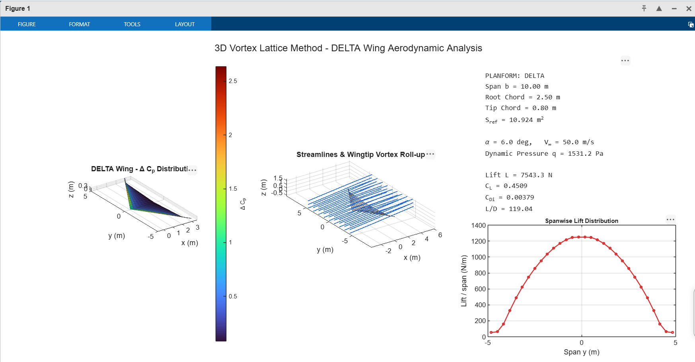

# 3D Interactive VLM Wing CFD & Aerodynamic Analyzer (MATLAB)

An interactive computational fluid dynamics (CFD) tool built in MATLAB utilizing the **3D Vortex Lattice Method (VLM)**. This solver models potential flow around custom aircraft wing planforms, computing surface pressure differentials ($\Delta C_p$), lift coefficients ($C_L$), induced drag ($C_{D,i}$), and 3D airflow streamlines.

---

## Performance Dashboard & 3D Visualizations

*Figure 1: 3D Surface Pressure Distribution ($\Delta C_p$), Airflow Streamlines with Wingtip Vortex Roll-up, and Spanwise Lift Distribution.*

---

## Key Features

- **Interactive UI Dialogs:** Native `menu()` and `inputdlg()` pop-up windows enable dynamic selection of airframe geometry (`RECTANGULAR`, `SWEPT`, `DELTA`, `FACETED_STEALTH`, `BLENDED_WING_BODY`) and flight dimensions without editing code lines.
- **3D VLM Numerical Engine:** Solves $[A][\Gamma] = [B]$ via horseshoe vortex panels, Biot-Savart induction law, and Neumann no-penetration boundary conditions.
- **Visual Performance Dashboard:** Renders real-time 3D surface pressure heatmaps, 3D airflow streamlines, wingtip vortex roll-up, and spanwise lift distribution graphs.
- **Stealth vs. Aerodynamics Case Study:** Evaluates performance degradation when transitioning from smooth curved airframes to low-RCS faceted geometries.

---

## Mathematical Formulation

1. **Biot-Savart Induction Law:**
   $$\vec{V}_{\text{induced}} = \frac{\Gamma}{4\pi} \frac{\vec{r}_1 \times \vec{r}_2}{|\vec{r}_1 \times \vec{r}_2|^2} \vec{r}_0 \cdot \left( \frac{\vec{r}_1}{|\vec{r}_1|} - \frac{\vec{r}_2}{|\vec{r}_2|} \right)$$

2. **No-Penetration Boundary Condition:**
   $$\vec{V}_{\text{total}} \cdot \hat{n}_i = 0 \quad \text{at all panel collocation points}$$

3. **Pressure Differential Calculation:**
   $$\Delta C_{p,i} = \frac{2 \Gamma_i \Delta y_i}{V_\infty S_i}$$

---

## How to Run

1. Open MATLAB (R2020a or newer).
2. Download and run `vlm_3d_wing_analyzer.m`.
3. Follow the pop-up GUI dialogs to select a planform and enter custom physical dimensions.
